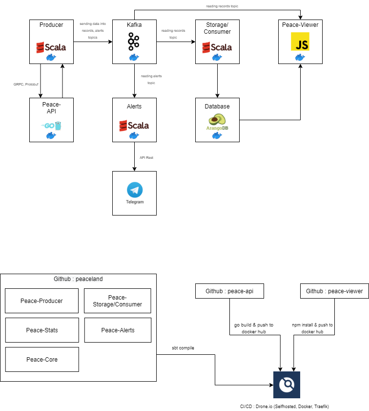
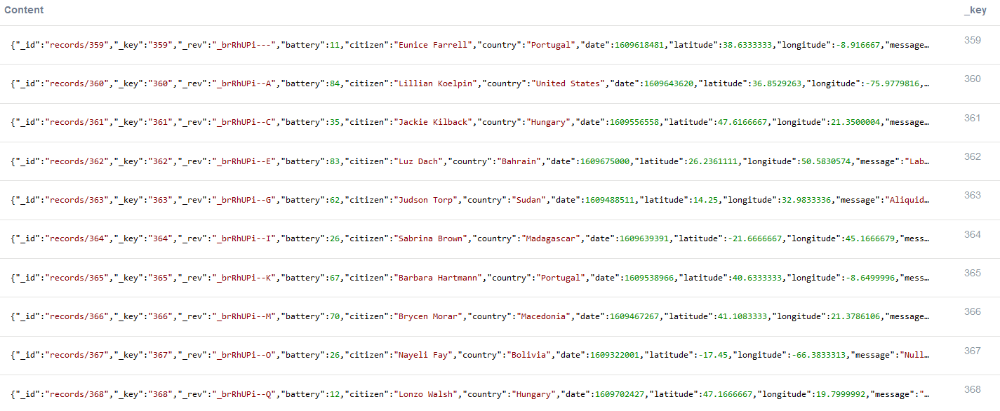
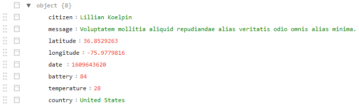
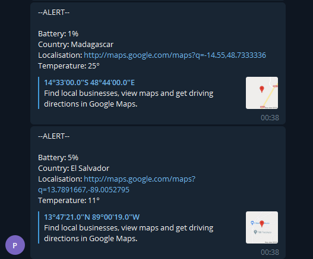
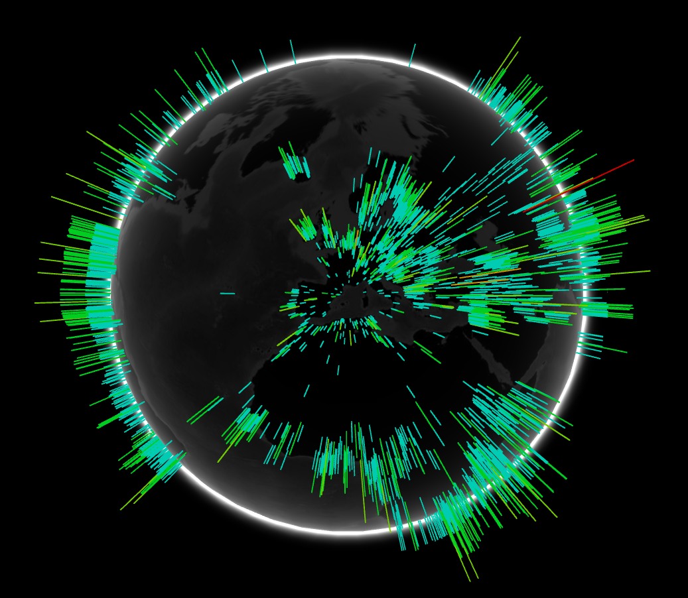
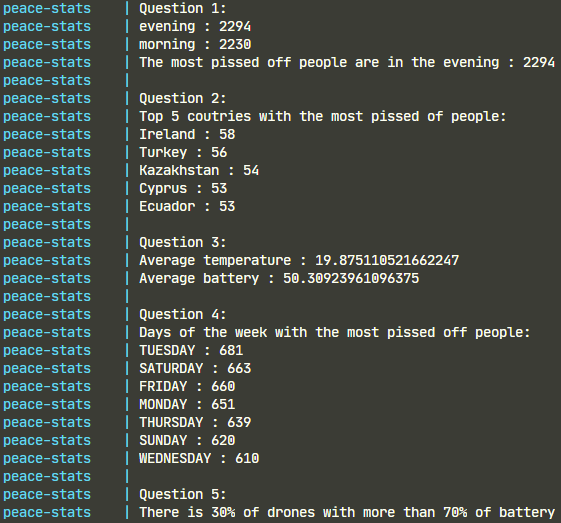

# Peaceland

Project at EFREI Paris in M1.

Course : M1 - APP Scala



## Launch project

To start everything you need, you can start the `Storage` project using the command below.

Just wait for the `Alerts` and `Storage` projects to be completely built.

This will start:
- Zookeeper
- Kafka
- Peace-api
- Arangodb
- Alerts (take time to build)
- Storage (take time to build)

```bash
$ docker-compose up storage
```

## Data generation

Start the `Producer` to generate 1000 events.
```bash
$ docker-compose up producer
```

All the events are generated using the `Peace-api` written in GO. The api is compatible with REST (on the branch `apiRest`) and GRPC.

When we ask the `Peace-api` to generate some events, using GRPC, the `Producer` will filter the events based on the generated sentences. 

We suppose, because `Peaceland`, that in a sentence we have to say at least one word about the leader.
Just for fun, and because the api generate lorem ipsum sentences, we just search for the word with the most occurrences. 

This word will be defined as `PresidentWord` for this generation of events (in a another generation the word can be different).

Then we analyze again all the events and if there is no occurences of the `PresidentWord` in the sentence we will send this event in the Kafka stream.

All these filtered events are stored in a multi-model graph database, `ArangoDB`.



Model of an event



## Alerts

We also send alerts to `Telegram` if the battery of the drone is lower or equal to 5%.

We use the `Telegram` Rest api to send custom messages in a group.



## Visualization

Start the `Peace-viewer` to display a 3d globe containing all the data inside the database.

This globe is dynamic. It means, you can start one or many `Producer` and the displayed data will update automatically.
```bash
$ docker-compose up peaceviewer
```


## More data generation

If you want to generate more data, just scale the amount of `Producer` to start.
```bash
$ docker-compose up --scale producer=2 producer
```

## Analytics

You can analyse the data in the database by running the `Stats` project.
```bash
$ docker-compose up stats
```

